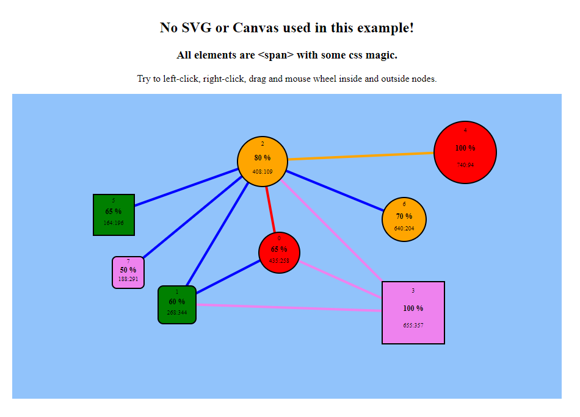

# d3-no-svg-example

## Example of using d3js to create interactive html (no SVG / Canvas)

### All elements are &lt;span&gt; with some css magic

## Demo

https://htmlpreview.github.io/?https://github.com/Oleg-Imanilov/d3-no-svg-example/blob/master/index.html
